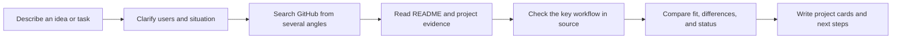

<div align="center">


# EW-SKILLS

[中文](README.zh-CN.md)

### Turn good ideas into skills your AI agent can use

<em>Practical, reusable, evidence-driven skills for developers and AI practitioners.</em>

<p>
  <a href="https://github.com/Ethan-Wang-dev/EW-Skills/stargazers"></a>
  <a href="https://github.com/Ethan-Wang-dev/EW-Skills/network/members"></a>
  <a href="https://github.com/Ethan-Wang-dev/EW-Skills/blob/main/LICENSE"></a>
  <a href="https://github.com/Ethan-Wang-dev/EW-Skills"></a>
</p>

<p><strong>Built with the tools and technologies:</strong></p>

<p>
  
  
  
  
</p>

[Get started](#get-started) · [EW-Repo Scout](ew-repo-scout/) · [Contribute](CONTRIBUTING.md)

</div>

---

## What is this?

EW-Skills is a growing collection of skills for AI coding agents. Each skill turns a difficult task into a clear workflow, useful tools, and an output you can check.

The first skill is **EW-Repo Scout**. Before you build a product, tool, or new skill, it finds related GitHub projects and shows their users, workflows, evidence, and boundaries.

## Why use it?

<table>
<tr>
<td width="50%">

### 🔎 Search from the real problem

Build queries from the user task, situation, and desired result. This avoids the false matches caused by searching one keyword.

</td>
<td width="50%">

### 🧭 Make “similar” clear

Separate direct products, adjacent products, technical components, and references. Rate product fit, feature coverage, and technical fit independently.

</td>
</tr>
<tr>
<td width="50%">

### 🧪 Check the key path

Trace the entry, processing, state or storage, and output for important projects. If the docs do not prove a claim, mark it as unconfirmed.

</td>
<td width="50%">

### 📋 Get a report you can act on

See the workflow, overlap, differences, maintenance, maturity, license, and evidence links. Decide what to use, borrow, or explore next.

</td>
</tr>
</table>

## Get started

Tell Codex or Claude Code:

```text
Install the ew-repo-scout Skill from https://github.com/Ethan-Wang-dev/EW-Skills.
```

Then describe your idea or task:

```text
Use EW-Repo Scout to find an existing Skill that saves web articles as Markdown and explain how to install and use it.
```

If the search direction is unclear, the agent asks one focused question first. After that it handles retrieval, evidence collection, and the report for you.

## EW-Repo Scout workflow



### What the report answers

| Question | What you get |
| --- | --- |
| Who built something similar? | Candidate repositories, discovery paths, and product positioning |
| Is it really similar? | A comparison of users, problem, workflow, and outcome |
| Does the key feature exist? | A source observation, documentation claim, or an explicit unknown |
| Which project should I read first? | Separate product, feature, and technical fit ratings |
| Can I reuse it? | Maintenance, maturity, license, and boundaries |

## Repository layout

```text
EW-Skills/
├── ew-repo-scout/
│   ├── SKILL.md                    # Skill rules and output requirements
│   ├── agents/openai.yaml          # Codex display name and default prompt
│   ├── scripts/
│   │   ├── github_discover.py      # GitHub retrieval, deduplication, and evidence
│   │   ├── render_report.py         # Validate and render project cards
│   │   └── evaluate_results.py     # Maintainer-only evaluation
│   ├── references/                 # Retrieval, comparison, and report rules
│   └── tests/                      # Regression tests
├── CONTRIBUTING.md
├── LICENSE
└── README.md
```

## Contribute

EW-Skills will keep growing. Open an Issue or Pull Request to:

- improve a skill's workflow or evidence rules;
- fix retrieval, deduplication, or report rendering;
- add a useful, reusable skill.

Fork the repository and adapt any skill to your workflow. See [CONTRIBUTING.md](CONTRIBUTING.md).

## License

Released under the [MIT License](LICENSE).

<div align="center">

**Every good idea deserves a faster next step.**

</div>
