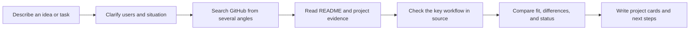

<div align="center">


# EW-SKILLS

[中文](README.zh-CN.md)

### Turn good ideas into skills your AI agent can use

<em>Practical, reusable, dependable skills for developers and AI practitioners.</em>

<p>
  <a href="https://github.com/Ethan-Wang-dev/EW-Skills/stargazers"></a>
  <a href="https://github.com/Ethan-Wang-dev/EW-Skills/network/members"></a>
  <a href="https://github.com/Ethan-Wang-dev/EW-Skills/blob/main/LICENSE"></a>
  <a href="https://github.com/Ethan-Wang-dev/EW-Skills"></a>
</p>

<p><strong>Built with the tools and technologies:</strong></p>

<p>
  
  
  
  
</p>

[Get started](#get-started) · [EW-Repo Scout](ew-repo-scout/) · [Contribute](CONTRIBUTING.md)

</div>

---

## What is this?

EW-Skills is a collection of AI Agent Skills that keeps growing. Each Skill turns a difficult task into a clear workflow, useful tools, and a result you can check, so your agent can help move the work forward with you.

The first example is **EW-Repo Scout**. Before you build a product, tool, or new skill, it finds related GitHub projects and shows their users, workflows, evidence, and boundaries. It is one example in EW-Skills; more skills will follow.

## EW-Repo Scout

Find open-source projects on GitHub that are similar to your idea, Skill, or product. Compare their users, problems, workflows, product differences, and implementation evidence. It can also find an existing Skill for your task and explain how to install it, call it, and meet its prerequisites.

### Why use it?

<table>
<tr>
<td width="50%">

### 🚀 Avoid wrong turns before you build

Before coding, see whether someone already solved it and how far they got, so you do not rebuild the same thing.

</td>
<td width="50%">

### 🎯 Find solutions that really fit

Do not let similar names or keywords mislead you. Find the projects and Skills that solve the same problem.

</td>
</tr>
<tr>
<td width="50%">

### 🧭 See the gap before you decide

See what you can use directly, what is worth borrowing, and what you still need to build.

</td>
<td width="50%">

### ⚡ Move to the next step faster

Turn scattered projects, information, and judgments into a clear path to use, validate, or build.

</td>
</tr>
</table>

## Get started

Tell Codex or Claude Code:

```text
Install the ew-repo-scout Skill from https://github.com/Ethan-Wang-dev/EW-Skills.
```

Then describe your idea or task:

```text
Use EW-Repo Scout to find an existing Skill that saves web articles as Markdown and explain how to install and use it.
```

If the search direction is unclear, the agent asks one focused question first. Once the direction is clear, it handles retrieval, evidence collection, and the report for you.

## How a Skill works

Every Skill has its own specialty, but most follow a similar path:



### What the report answers

| Question | What you get |
| --- | --- |
| Who built something similar? | Candidate repositories, discovery paths, and product positioning |
| Is it really similar? | A comparison of users, problem, workflow, and outcome |
| Does the key feature exist? | A source observation, documentation claim, or an explicit unknown |
| Which project should I read first? | Separate product, feature, and technical fit ratings |
| Can I reuse it? | Maintenance, maturity, license, and boundaries |

## Repository layout

```text
EW-Skills/
├── ew-repo-scout/
│   ├── SKILL.md                    # Skill rules and output requirements
│   ├── agents/openai.yaml          # Codex display name and default prompt
│   ├── scripts/
│   │   ├── github_discover.py      # GitHub retrieval, deduplication, and evidence
│   │   ├── render_report.py         # Validate and render project cards
│   │   └── evaluate_results.py     # Maintainer-only evaluation
│   ├── references/                 # Retrieval, comparison, and report rules
│   └── tests/                      # Regression tests
├── CONTRIBUTING.md
├── LICENSE
└── README.md
```

## Local validation

For EW-Repo Scout:

```bash
python3 -m unittest discover -s ew-repo-scout/tests -v
```

For higher GitHub API quotas or Code Search, set `GITHUB_TOKEN` or `GH_TOKEN`. Unauthenticated requests can still use Repository, Topic, and README search, but are more likely to hit GitHub rate limits.

## Contribute

EW-Skills will keep growing. Found a problem? Open an Issue. Have an improvement? Send a Pull Request. Want to share your own Skill? Bring it here:

- improve a skill's workflow or evidence rules;
- fix retrieval, deduplication, or report rendering;
- add a useful, reusable skill.

Whether it is a one-line wording fix, a small bug fix, or a brand-new Skill, contributions are welcome. Fork the repository and adapt it to your workflow. See [CONTRIBUTING.md](CONTRIBUTING.md).

## License

Released under the [MIT License](LICENSE).

<div align="center">

**Bring your idea. Let us make the next step together.**

</div>
