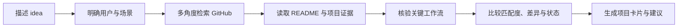

<div align="center">

# EW-Skills

[English](README.md)

### 把想法变成可以直接使用的 AI Skill

为开发者和 AI 实践者持续打磨实用、可复用、证据驱动的 Skills。

<p>
  <a href="https://github.com/Ethan-Wang-dev/EW-Skills/stargazers"></a>
  <a href="https://github.com/Ethan-Wang-dev/EW-Skills/network/members"></a>
  <a href="https://github.com/Ethan-Wang-dev/EW-Skills/blob/main/LICENSE"></a>
  <a href="https://github.com/Ethan-Wang-dev/EW-Skills"></a>
</p>

[开始使用](#快速开始) · [查看 EW-Repo Scout](ew-repo-scout/) · [参与贡献](CONTRIBUTING.md)

</div>

---

## 这是什么

EW-Skills 是一个面向 AI 编程 Agent 的 Skill 集合。每个 Skill 都把一类复杂任务整理成清晰的工作流、可执行的工具调用和可检查的输出，让 Agent 不只给出建议，也能沿着证据把事情做完。

当前仓库的第一个 Skill 是 **EW-Repo Scout**：在开发产品、工具或新 Skill 之前，先从 GitHub 找到相似项目，读懂它们的用户、工作流、实现证据和边界。

## 为什么值得用

<table>
<tr>
<td width="50%">

### 🔎 从问题出发搜索

从用户任务、使用场景和期望结果构造多角度查询，减少只搜关键词带来的误判和遗漏。

</td>
<td width="50%">

### 🧭 把“像不像”讲清楚

区分直接产品、相邻产品、技术组件和参考项目，分别评估产品匹配、功能覆盖与技术匹配。

</td>
</tr>
<tr>
<td width="50%">

### 🧪 沿关键路径核验

对重点项目追踪入口、处理、状态/存储和输出；文档没证明的内容会明确标为未确认。

</td>
<td width="50%">

### 📋 输出可以做决定的报告

报告包含工作流、重合与差异、维护状态、成熟度、许可证和证据链接，方便决定复用、借鉴还是继续探索。

</td>
</tr>
</table>

## 快速开始

### 1. 安装 Skill

对 Codex 或 Claude Code 说：

```text
帮我安装 https://github.com/Ethan-Wang-dev/EW-Skills 中的 ew-repo-scout Skill。
```

### 2. 描述你的 idea

```text
用 EW-Repo Scout 帮我找：有没有能把网页剪藏到本地、方便个人整理和搜索的开源项目？
```

Agent 会在检索方向存在关键歧义时先提出一个澄清问题；确认后自动完成检索、证据收集和报告生成，你不需要手动运行脚本。

## EW-Repo Scout 工作流



### 报告会回答什么

| 你想知道的事 | 报告提供的答案 |
| --- | --- |
| 谁做过类似的东西？ | 候选仓库、发现路径和项目定位 |
| 它们到底像不像？ | 用户、问题、工作流和结果的分层比较 |
| 关键功能真的存在吗？ | 源码观察、文档声明或未确认 |
| 哪个值得先看？ | 独立的匹配度、功能覆盖和技术匹配评分 |
| 项目能不能放心复用？ | 维护样本、成熟度、许可证和边界 |

## 仓库结构

```text
EW-Skills/
├── ew-repo-scout/
│   ├── SKILL.md                    # Skill 行为规则与输出要求
│   ├── agents/openai.yaml          # Codex 界面名称与默认提示词
│   ├── scripts/
│   │   ├── github_discover.py      # GitHub 检索、去重、缓存与证据采集
│   │   ├── render_report.py         # 校验并渲染项目卡片
│   │   └── evaluate_results.py     # 维护者内部评测
│   ├── references/                 # 检索、比较和报告契约
│   └── tests/                      # 脚本回归测试
├── CONTRIBUTING.md
├── LICENSE
└── README.md
```

## 本地验证

运行 EW-Repo Scout 的回归测试：

```bash
python3 -m unittest discover -s ew-repo-scout/tests -v
```

需要 GitHub API 更高配额或 Code Search 时，设置 `GITHUB_TOKEN` 或 `GH_TOKEN`。未认证请求仍可使用 Repository、Topic 和 README 检索，但更容易遇到 GitHub 限流。

## 参与贡献

欢迎提交 Issue 或 Pull Request：

- 改进现有 Skill 的工作流和证据标准；
- 修复检索、去重和报告渲染问题；
- 提交新的、可复用的 Skill。

贡献流程见 [CONTRIBUTING.md](CONTRIBUTING.md)。

## 许可证

本项目采用 [MIT License](LICENSE)。

<div align="center">

**让每个好想法，都能更快找到下一步。**

</div>
