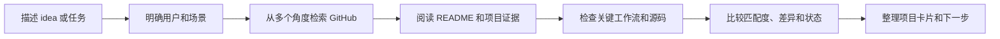

<div align="center">


# EW-SKILLS

[English](README.md)

### 让 AI Agent 成为真正可靠的协作者

<em>Skill 不只是提示词，而是把上下文、工作流、工具和检查标准组合起来，让 Agent 从理解需求一路推进到可验证的结果。</em>

<p>
  <a href="https://github.com/Ethan-Wang-dev/EW-Skills/stargazers"></a>
  <a href="https://github.com/Ethan-Wang-dev/EW-Skills/network/members"></a>
  <a href="https://github.com/Ethan-Wang-dev/EW-Skills/blob/main/LICENSE"></a>
  <a href="https://github.com/Ethan-Wang-dev/EW-Skills"></a>
</p>

<p><strong>使用的工具和技术：</strong></p>

<p>
  
  
  
  
</p>

[开始使用](#快速开始) · [查看 EW-Repo Scout](ew-repo-scout/) · [参与贡献](CONTRIBUTING.zh-CN.md)

</div>

---

## 这是什么

EW-Skills 是一个会持续长大的 AI Agent Skill 集合。每个 Skill 都把一类复杂任务整理成清晰的步骤、合适的工具和可以检查的结果，让 Agent 不只是给建议，而是陪你把事情推进下去。

当前仓库的第一个示例是 **EW-Repo Scout**。它帮助你在开发产品、工具或新 Skill 前，找到 GitHub 上相似的项目，弄清楚它们服务谁、解决什么问题、怎么工作，以及哪些地方值得借鉴。它只是 EW-Skills 的一个示例，后续还会加入更多 Skill。

## EW-Repo Scout

在 GitHub 上发现与 idea、Skill 或产品相似的开源项目，并比较目标用户、问题、工作流、产品差异和实现证据。它也可以帮你寻找满足当前任务的现成 Skill，并说明安装、调用方式和前置条件。

### 为什么值得用

<table>
<tr>
<td width="50%">

### 🚀 开始前少走弯路

动手开发前，先知道有没有人做过、别人做到哪一步，避免重复造轮子。

</td>
<td width="50%">

### 🎯 找到真正相关的方案

不再被相似的名字和关键词误导，找到真正解决同一个问题的项目和 Skill。

</td>
</tr>
<tr>
<td width="50%">

### 🧭 看清差距再做决定

知道哪些可以直接使用，哪些适合借鉴，哪些地方还需要自己补上。

</td>
<td width="50%">

### ⚡ 更快走到下一步

把分散的项目、信息和判断整理好，让你更快开始使用、验证或开发。

</td>
</tr>
</table>

## 快速开始

以当前的 EW-Repo Scout 为例，对 Codex 或 Claude Code 说：

```text
帮我安装 https://github.com/Ethan-Wang-dev/EW-Skills 中的 ew-repo-scout Skill。
```

然后描述你的 idea 或任务：

```text
用 EW-Repo Scout 帮我找一个能把网页文章整理成 Markdown 的现成 Skill，并告诉我怎么安装和使用。
```

如果任务存在会改变方向的歧义，Agent 会先问一个关键问题；方向确定后，就会自动完成检索、证据收集和结果整理。

## Skill 如何工作

每个 Skill 都有自己的拿手好戏，但通常会经历：



### 报告会回答什么

| 你想知道什么 | 你会得到什么 |
| --- | --- |
| 谁做过类似的东西？ | 候选仓库、发现路径和产品定位 |
| 它真的相似吗？ | 对目标用户、问题、工作流和结果的比较 |
| 关键功能真的存在吗？ | 源码观察、文档证据，或明确标注的未知项 |
| 应该先看哪个项目？ | 分开的产品、功能和技术匹配度 |
| 能不能直接复用？ | 维护状态、成熟度、许可证和适用边界 |

## 仓库结构

```text
EW-Skills/
├── ew-repo-scout/
│   ├── SKILL.md                    # Skill 行为规则与输出要求
│   ├── agents/openai.yaml          # Codex 界面名称与默认提示词
│   ├── scripts/
│   │   ├── github_discover.py      # GitHub 检索、去重和证据收集
│   │   ├── render_report.py        # 校验并渲染项目卡片
│   │   └── evaluate_results.py     # 维护者使用的评测工具
│   ├── references/                 # 检索、比较和报告规则
│   └── tests/                      # 回归测试
├── CONTRIBUTING.md
├── LICENSE
└── README.md
```

## 本地验证

以 EW-Repo Scout 为例：

```bash
python3 -m unittest discover -s ew-repo-scout/tests -v
```

需要更高 GitHub API 配额或 Code Search 时，设置 `GITHUB_TOKEN` 或 `GH_TOKEN`。未认证请求仍可使用 Repository、Topic 和 README 检索，但更容易遇到 GitHub 限流。

## 一起来贡献

EW-Skills 还在不断成长，欢迎来一起把它变得更好！发现问题就提 Issue，想到改进就发 Pull Request，想分享自己的 Skill 也可以直接来：

- 改进现有 Skill 的工作流和证据标准；
- 修复脚本、工具调用和输出问题；
- 提交新的、可复用的 Skill。

不管是改一行文案、修一个小问题，还是带来一个全新的 Skill，都欢迎。你也可以先 Fork，按自己的工作流改起来。详细流程见 [中文贡献说明](CONTRIBUTING.zh-CN.md)。

## 许可证

本项目采用 [MIT License](LICENSE)。

<div align="center">

**带着你的想法来，一起把下一步做出来。**

</div>
