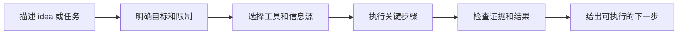

<div align="center">

# EW-Skills

[English](README.md)

### 把好想法变成 AI Agent 可以直接使用的 Skill

为开发者和 AI 实践者持续打磨实用、可复用、以证据为基础的 Skills。

<p>
  <a href="https://github.com/Ethan-Wang-dev/EW-Skills/stargazers"></a>
  <a href="https://github.com/Ethan-Wang-dev/EW-Skills/network/members"></a>
  <a href="https://github.com/Ethan-Wang-dev/EW-Skills/blob/main/LICENSE"></a>
  <a href="https://github.com/Ethan-Wang-dev/EW-Skills"></a>
</p>

[开始使用](#快速开始) · [查看当前 Skill](ew-repo-scout/) · [参与贡献](CONTRIBUTING.md)

</div>

---

## 这是什么

EW-Skills 是一个持续更新的 AI Agent Skill 集合。每个 Skill 都把一类复杂任务整理成清晰的步骤、合适的工具和可以检查的结果，让 Agent 不只是给建议，而是帮助你把事情推进下去。

当前仓库的第一个示例是 **EW-Repo Scout**。它帮助你在开发产品、工具或新 Skill 前，找到 GitHub 上相似的项目，弄清楚它们服务谁、解决什么问题、怎么工作，以及哪些地方值得借鉴。它只是 EW-Skills 的一个示例，后续还会加入更多 Skill。

## 为什么值得用

<table>
<tr>
<td width="50%">

### 🔎 从真实任务开始

先明确你要解决的问题、使用场景和期望结果，再选择检索或执行方式。

</td>
<td width="50%">

### 🧭 把复杂事情拆开

把一个大目标拆成可以执行的步骤，减少遗漏，也方便在中途发现问题。

</td>
</tr>
<tr>
<td width="50%">

### 🧪 用证据检查结果

需要时读取文档、代码和运行状态；没有确认的内容会明确标出来。

</td>
<td width="50%">

### 📋 输出下一步能用的结果

结果会说明做了什么、依据是什么、还有什么限制，以及你接下来可以怎么做。

</td>
</tr>
</table>

## 当前 Skill

### [EW-Repo Scout](ew-repo-scout/)

在 GitHub 上发现与 idea、Skill 或产品相似的开源项目，并比较目标用户、问题、工作流、产品差异和实现证据。它也可以帮你寻找满足当前任务的现成 Skill，并说明安装、调用方式和前置条件。

## 快速开始

以当前的 EW-Repo Scout 为例，对 Codex 或 Claude Code 说：

```text
帮我安装 https://github.com/Ethan-Wang-dev/EW-Skills 中的 ew-repo-scout Skill。
```

然后描述你的 idea 或任务：

```text
用 EW-Repo Scout 帮我找一个能把网页文章整理成 Markdown 的现成 Skill，并告诉我怎么安装和使用。
```

如果任务存在会改变方向的歧义，Agent 会先问一个关键问题；确认后自动完成需要的检索、证据收集和结果整理。

## Skill 如何工作

不同 Skill 的具体步骤会不同，但通常会经历：



## 仓库结构

```text
EW-Skills/
├── ew-repo-scout/
│   ├── SKILL.md                    # Skill 行为规则与输出要求
│   ├── agents/openai.yaml          # Codex 界面名称与默认提示词
│   ├── scripts/                   # 可复用脚本
│   ├── references/                # 工作流、证据和输出规则
│   └── tests/                     # 回归测试
├── CONTRIBUTING.md
├── LICENSE
└── README.md
```

## 本地验证

以 EW-Repo Scout 为例：

```bash
python3 -m unittest discover -s ew-repo-scout/tests -v
```

需要更高 GitHub API 配额或 Code Search 时，设置 `GITHUB_TOKEN` 或 `GH_TOKEN`。未认证请求仍可使用 Repository、Topic 和 README 检索，但更容易遇到 GitHub 限流。

## 参与贡献

EW-Skills 会持续增加和改进。欢迎提交 Issue 或 Pull Request：

- 改进现有 Skill 的工作流和证据标准；
- 修复脚本、工具调用和输出问题；
- 提交新的、可复用的 Skill。

你可以 Fork 后按自己的工作流修改。贡献流程见 [CONTRIBUTING.md](CONTRIBUTING.md)。

## 许可证

本项目采用 [MIT License](LICENSE)。

<div align="center">

**让每个好想法，都能更快找到下一步。**

</div>
